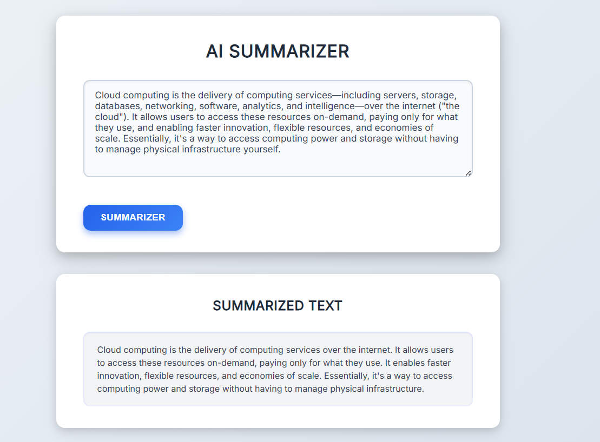

````markdown
# AI Summarizer

An AI-powered text summarization web app using Hugging Face's BART model.  
Paste your text and get a concise summary in bullet points and paragraphs.

---

## Features

- Summarizes long texts into easy-to-read bullet points and paragraphs
- Uses Hugging Face's `facebook/bart-large-cnn` model for summarization
- Saves recent summaries in local storage for quick access
- Clean and responsive UI with plain HTML, CSS, and JavaScript

---

## Getting Started

### Prerequisites

- A Hugging Face API token. You can get one by creating an account at [Hugging Face](https://huggingface.co/) and generating an access token.
- Basic knowledge of HTML, CSS, and JavaScript.

### Setup

1. Clone this repository:

   ```bash
   git clone https://github.com/yourusername/Summarizer-app.git
   cd Summarizer-app
````

2. Create a `.env` file in the root directory and add your API key:

   ```env
   HF_API_TOKEN=your_huggingface_api_token_here
   ```

3. Make sure your JavaScript fetch request reads the API key from environment variables or a secure backend (recommended).

4. Open `index.html` in a web browser to use the app.

---

## Demo of this Weppage

## Usage

* Paste or type the text you want summarized in the input box.
* Click the **Summarizer** button.
* View the summarized output below the button.

---

## Security

**Important:** Do NOT commit or expose your API keys publicly. Use environment variables or backend to keep keys secret.

---


